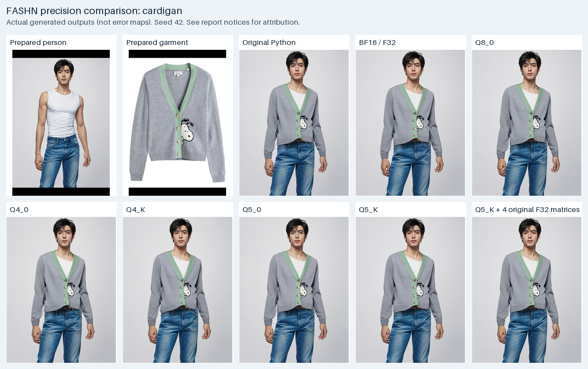
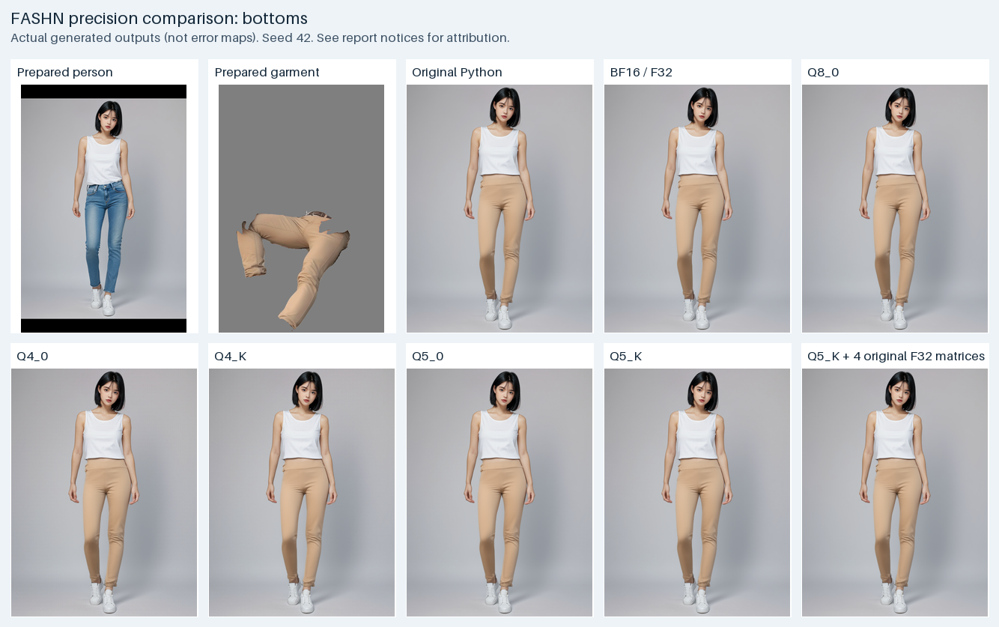

# FASHN precision output gallery

These sheets contain **actual generated outputs**, not amplified differences.
Read [the measured results](../q4-q5-results.md) and
[image licensing/attribution notices](../NOTICE.md).

For zoom, reference selection, overlay comparisons, numerical errors,
latency and memory, download [the standalone HTML](../fashn-all-comparisons.html)
and open it locally. No separate image folder is needed for that HTML.
The [original Python baseline](../original-python-baseline.md) identifies the
unchanged upstream sampler behind the Python images and its measured latency
and memory; it is not the separate forced-math numerical oracle.

## Cardigan

Original-resolution crops:
[Python](images/cardigan-python.png) |
[BF16/F32](images/cardigan-bf16.png) |
[Q8_0](images/cardigan-q8_0.png) |
[Q4_0](images/cardigan-q4_0.png) |
[Q4_K](images/cardigan-q4_K.png) |
[Q5_0](images/cardigan-q5_0.png) |
[Q5_K](images/cardigan-q5_K.png) |
[Q5_K + four F32](images/cardigan-selected-mixed.png).

## Bottoms

Original-resolution crops:
[Python](images/bottoms-python.png) |
[BF16/F32](images/bottoms-bf16.png) |
[Q8_0](images/bottoms-q8_0.png) |
[Q4_0](images/bottoms-q4_0.png) |
[Q4_K](images/bottoms-q4_K.png) |
[Q5_0](images/bottoms-q5_0.png) |
[Q5_K](images/bottoms-q5_K.png) |
[Q5_K + four F32](images/bottoms-selected-mixed.png).

All shown policies use seed 42 and matching prepared inputs. Contact-sheet
thumbnails are resized; linked output PNGs preserve the original bytes.
Input sources and generated adaptations are not covered indiscriminately
by the repository's code license.
